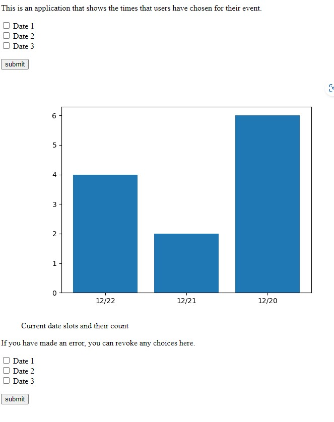

# Voting-Site
This is a simple app made with Flask that allows a user to input the date they prefer, and then see the results. The data is stored using sqlite and connected to using sqlalchemy.

The intuition for sqlalchemy is so that there is no need for a database server. 

This project to get some practice in writing an API.

## Output for End User

